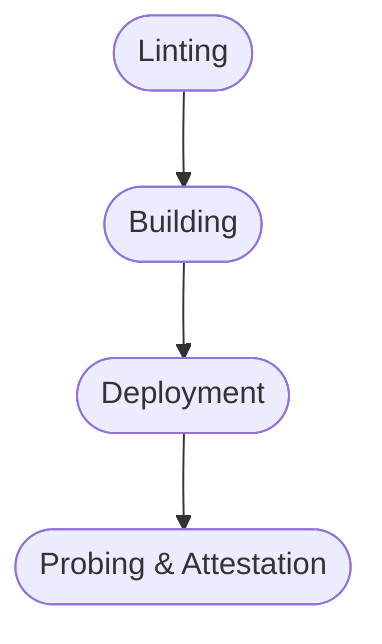

> _This is an opinionated analysis._
>
> _It helps structure reasoning about CI/CD in the context of Nix & Standard, in general.
> For tighter integration, Standard developed matching semantics through CI Registers._

# CI/CD at 5000 feet

Let's look at the general Continous Integration (CI) and Continous Delivery (CD) problem from a 5000 feet flight height.

To get ourselves an overview, we use the industry standard for process analysis: [BPMN 2.0][bpmn-2].

You may draw benefit from looking up it's [fundamentals][bpmn-fundamentals], at this point.
But don't worry, we'll also walk you through the diagram.

<a href="ci-cd-10000-feet.svg" target="_blank">

</a>

## General Phases

There are general phases that further structure the CI/CD problem.



For automating these following phases beyond writing CI pipelines, we introduce the concept of [The Registry][glossary-registry] for CI purposes that holds Registers that match the phases.

### Linting Phase

```yaml
Register: __std.ci.lint # list (order) of attrs (parallel) of lint task actions
```

The linting phase very fundamentally ensures that the code base is shaped according to expectation.
This can involve verification of formatting, style and code generation.

Typically, these are freeform repository tasks that invoke tools to get the job done.

In the local development, you would use a task-runner like [`just`][just] or [`devshell`][devshell] to invoke these commands.
See also [Standard's Just Integration][std-just] for practical guidance.

We can think of these task runners as the _views_ within the [MVC pattern][mvc] into the _actual_ task definitions.

The task definitions are typically located in a "Tasks" (`tasks.nix`) Cell Block of the [`tasks` Block Type (`blockType.tasks`)][blocktype-tasks].

Ensuring an expected shape of the code base is the annoying, but relatively _cheap_ paperwork (through repoautomation), that we do in order to unlock the next phase: the building phase.

In the case that we need to ensure sequenciality, the register can be filled in sequential chuncks of targets that can be run in parallel.

### Building Phase

```yaml
Register: __std.ci.build # list (order) of attrs (parallel) of derivations
```

Since [Nix's superpowers][nix-superpower] are derivations, we rely on this fundamental capability to built up a fully declarative, parallelized and reproducible build pipeline.

This pipeline should be typically backed by a powerful build server farm.

So all that we really do here is to fill the CI register with build targets.

However, it is important that Unit Tests are embedded as part of the Nix build pipeline.
This ensures for everyones sanity, that only a unit-tested build-arifact counts as a successful build.

In the case that we need to ensure sequenciality, the register can be filled in sequential chuncks of targets that can be built in parallel.

### Deployment Phase

```yaml
Register: __std.ci.deploy # list (order) of attrs (parallel) of deployment actions
```

The deployment phase schedules deployment artifacts via schematic target state (data-)manifests.
It pushes the target state onto a (potentially stateful) control loop via a (potentially remote) API interface.

The specific Block Type Action pushed to the `__std.ci.deploy` Register determins _how_ this process is to be accomplished.

> **Push vs Pull Workflows**
>
> This concept enacts a push-based workflow as opposed to a pull-based workflow.
> Push-based workflows are predominant in DevOps, but they actually puncture security holes into your target infrastructure.
> There is no way around _listening_ on some port for the push to happen.
>
> Pull-based workflows don't suffer from this structural shortcoming and we may explore them closer in the future.

> **Orchestration vs Choreography**
>
> This concept enacts a form of orchestration.
> For increasingly complex infrastructure, there is little room for fogoing the benefits of orchestration over choreography, such as having a tigthened control loop.
>
> Typically, push-based workflows use orchestration, because the can afford state locally and, hence, cheaply.
>
> Typically, pull-based wowkflows use choreography, because they can't orchestrate without global (i.e. remote) state and, hence, complexity.
>
> An ideal approach would be an orchestrating pull-based approach via some sort of remote _clearance state machine_ that can be programmed via an API.
> We might explore this approach in the future.

Sequenciality can be achieved via the Register the same way as in the other phases.
However, you need to understand, that only a single ("development") environment is ready for automatic targeting after building and unit testing.

The propagation rules for additional environments such as any staging and production-type environments can't be specified via this mechanisms.
These propagations tightly interact with the Probing & Attestation Phase and not infrequently require even manual or discretionary input.

### Probing & Attestation Phase

```yaml
Register: n/a
```

The probing and attestation phase is highly situation specific.
It cannot be adequately represented through Standardization and requires an entirely different control loop.

Scenarios can include probing and attestation for the purpose of deploying a SaaS product into a specifit target infrastructure topology; or it could be targeting a managed on-site deployment.

During this phase a mix of short- & longlived Suites are run against a particular target environment, usually staging.

Some of these suites can be automated in a proper scheduling framework, others are inherently manual.

> **Workflow Scheduler vs General Purpose Control Loops**
>
> If a scheduler is chosen for the implementation, keep the following in mind:
>
> Options range from more specific workflow schedulers (typically CI) to more general purpose control loops.
> Examples for general purpose control loops are the cloud scheduling family, but also operator framworks can be considered.
>
> The closer to production we get, the more we observe a fitness continuum between workflow state machines and the actual production control loops.
>
> The right tool should be chosen for any given specific suite.

These Suites can include, among others:

- Pen Testing
- Property-Based Testing/Fuzzing
- Monkey Testing
- Load Testing
- E2E Testing
- Benchmarking
- Smoke Testing
- Runtime & Code Auditing

---

[bpmn-2]: https://www.omg.org/spec/BPMN/2.0/
[bpmn-fundamentals]: https://camunda.com/bpmn/reference/
[ci-cd-bpmn]: ci-cd-10000-feet.svg "CI-CD BPMN Model"
[just]: https://just.systems/
[devshell]: https://numtide.github.io/devshell/
[mvc]: https://en.wikipedia.org/wiki/Model%E2%80%93view%E2%80%93controller
[std-just]: ../reference/std/nixago/just.md
[blocktype-tasks]: ../reference/blocktypes/task-blocktype.md
[nix-superpower]: ../explain/why-nix.md#nix-superpowers
